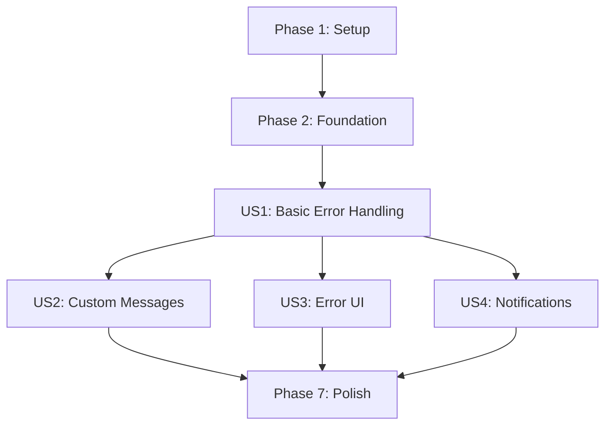

# Implementation Tasks for Enhanced Error Handling

## Phase 1: Setup

- [x] T001 Create project structure for error handling implementation
- [x] T002 [P] Add TypeScript decorator support configuration in tsconfig.json
- [x] T003 [P] Configure Jest for testing error handling scenarios
- [ ] T004 Setup circular buffer implementation for notification management
- [ ] T005 Add error handling interfaces to types.d.ts

## Phase 2: Foundation

- [ ] T006 Implement base ErrorResult interface in src/types/ErrorResult.ts
- [ ] T007 Create ErrorHandlerConfig interface in src/types/ErrorHandlerConfig.ts
- [ ] T008 [P] Add ErrorNotification interface in src/types/ErrorNotification.ts
- [ ] T009 Create notification buffer service in src/services/NotificationBuffer.ts
- [ ] T010 Implement error category registry in src/services/ErrorCategoryRegistry.ts

## Phase 3: Basic Error Handling (User Story 1)

**Goal**: Enable basic error handling with minimal boilerplate using decorators

**Test Criteria**: Decorator catches errors, logs them, returns standardized response

- [ ] T011 [US1] Create base handleError decorator in src/decorators/handleError.ts
- [ ] T012 [P] [US1] Add error logging integration in src/services/ErrorLogger.ts
- [ ] T013 [US1] Implement standardized error response wrapper in src/utils/ErrorWrapper.ts
- [ ] T014 [P] [US1] Create error handling examples in examples/06-error-handling-plugin.ts
- [ ] T015 [US1] Add unit tests for basic error handling in tests/decorators/handleError.test.ts

## Phase 4: Custom Error Messages (User Story 2)

**Goal**: Support custom error messages through decorator configuration

**Test Criteria**: Custom messages appear in error responses while preserving original error details

- [ ] T016 [US2] Add message customization to handleError decorator in src/decorators/handleError.ts
- [ ] T017 [P] [US2] Implement error message formatter in src/utils/ErrorFormatter.ts
- [ ] T018 [US2] Create custom message examples in examples/06-error-handling-plugin.ts
- [ ] T019 [P] [US2] Add tests for custom messages in tests/decorators/handleError.messages.test.ts

## Phase 5: Error UI Handling (User Story 3)

**Goal**: Support custom error UI for render method failures

**Test Criteria**: Error UI renderer is called with error details and produces correct output

- [ ] T020 [US3] Add UI renderer support to handleError decorator in src/decorators/handleError.ts
- [ ] T021 [P] [US3] Create ErrorUIRenderer interface in src/types/ErrorUIRenderer.ts
- [ ] T022 [US3] Implement default error UI components in src/ui/ErrorComponents.ts
- [ ] T023 [P] [US3] Add error UI examples in examples/06-error-handling-plugin.ts
- [ ] T024 [US3] Create tests for error UI rendering in tests/ui/ErrorComponents.test.ts

## Phase 6: Error Notifications (User Story 4)

**Goal**: Display errors in notification panel with categorization and rate limiting

**Test Criteria**: Errors appear in notification panel with correct details and respect rate limits

- [ ] T025 [US4] Implement notification manager in src/services/NotificationManager.ts
- [ ] T026 [P] [US4] Add rate limiting service in src/services/RateLimiter.ts
- [ ] T027 [US4] Create notification actions handler in src/services/ActionHandler.ts
- [ ] T028 [P] [US4] Implement notification category manager in src/services/CategoryManager.ts
- [ ] T029 [US4] Add notification examples in examples/06-error-handling-plugin.ts
- [ ] T030 [P] [US4] Create notification tests in tests/services/NotificationManager.test.ts

## Phase 7: Polish & Cross-cutting

- [ ] T031 [P] Implement performance monitoring in src/services/PerformanceMonitor.ts with 5ms threshold tracking
- [ ] T032 [P] Create comprehensive documentation in docs/error-handling.md
- [ ] T033 [P] Add memory usage monitoring in src/services/MemoryMonitor.ts
- [ ] T034 Update API documentation with error handling examples
- [ ] T035 Create error handling migration guide in docs/migrations.md with pattern migration examples

## Dependencies

## Parallel Execution Opportunities

### User Story 1
- Tests and implementation can be parallelized
- Error logging and wrapper implementation can be done in parallel

### User Story 2
- Message formatter and tests can be developed independently
- Examples can be created in parallel with implementation

### User Story 3
- UI components and renderer interface can be developed in parallel
- Tests can be written alongside implementation

### User Story 4
- Rate limiting and category management can be parallelized
- Notification manager and action handler can be developed independently

## Implementation Strategy

1. MVP Scope (User Story 1):
   - Basic error handling decorator
   - Standard error logging
   - Error response wrapper
   
2. Incremental Delivery:
   - Custom messages (US2) - enhances user feedback
   - Error UI (US3) - improves error visualization
   - Notifications (US4) - completes the feature
   
3. Performance Optimization:
   - Memory monitoring
   - Rate limiting
   - Buffer optimization